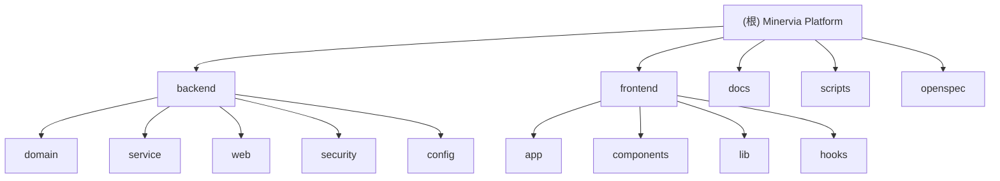

# Minervia Institute - 教育平台架构文档

> 最后更新：2026-02-09

## 变更记录 (Changelog)

### 2026-02-09
- 初始化架构文档
- 完成项目结构扫描（覆盖率 40%）
- 识别核心模块：backend (Kotlin/Spring Boot)、frontend (Next.js/TypeScript)
- 记录基础设施组件：MySQL、Redis、Kafka、Elasticsearch
- 生成模块索引与结构图

---

## 项目愿景

Minervia Institute 是一个全栈教育管理平台，提供学生注册、管理员管理、学生门户和多语言营销网站。

**核心功能**：
- 学生注册系统：多步骤注册流程，邮箱验证，实时状态追踪（WebSocket）
- 管理员门户：申请审核、学生管理、注册码生成、审计日志
- 学生门户：个人仪表板、课程查看、文档管理、个人资料
- 营销网站：多语言支持（英语、波兰语、中文），SEO 优化

---

## 架构总览

### 技术栈

**后端（backend/）**：
- Kotlin + Spring Boot 3.4.1
- MySQL 8.0（数据持久化）
- Redis 7（缓存与会话管理）
- Kafka（异步任务队列）
- Elasticsearch 8.11（审计日志搜索）
- Flyway（数据库迁移）
- WebSocket（实时通信）
- JWT（双 Token 认证：Access Token 30min + Refresh Token 14天）

**前端（frontend/）**：
- Next.js 14（App Router）
- TypeScript 5.7
- Tailwind CSS 3.4
- next-intl 3.26（国际化）
- Radix UI（无障碍组件库）
- Vitest + Testing Library（测试）

**基础设施**：
- Docker + Docker Compose
- Gradle 8.x（后端构建）
- pnpm（前端包管理）

---

## 模块结构图



---

## 模块索引

| 模块 | 路径 | 语言 | 职责 | 入口文件 | 文档 |
|------|------|------|------|----------|------|
| **backend** | `backend/` | Kotlin | Spring Boot 后端服务 | `MinerviaApplication.kt` | [查看](./backend/CLAUDE.md) |
| **frontend** | `frontend/` | TypeScript | Next.js 前端应用 | `src/app/layout.tsx` | [查看](./frontend/CLAUDE.md) |
| **docs** | `docs/` | Markdown | 部署与快速开始文档 | `DEPLOYMENT.md`, `QUICKSTART.md` | - |
| **scripts** | `scripts/` | Bash | 部署与管理脚本 | `deploy.sh`, `minervia.sh` | - |
| **openspec** | `openspec/` | - | API 规范文档 | - | - |

---

## 运行与开发

### Docker 部署（推荐）

```bash
# 1. 复制环境变量模板
cp .env.example .env

# 2. 配置环境变量（必须设置 JWT_SECRET、数据库密码等）
nano .env

# 3. 启动所有服务
./scripts/deploy.sh

# 4. 查看状态
./scripts/minervia.sh status

# 5. 查看日志
./scripts/minervia.sh logs [backend|frontend|mysql|redis]
```

### 本地开发

**后端**：
```bash
cd backend
./gradlew bootRun
```

**前端**：
```bash
cd frontend
pnpm install
pnpm dev
```

**访问地址**：
- 前端：http://localhost:3000
- 后端 API：http://localhost:8080
- API 文档：http://localhost:8080/swagger-ui.html
- 管理员登录：http://localhost:3000/en/login
- 学生门户：http://localhost:3000/en/portal/login

---

## 测试策略

### 后端测试

**单元测试**：
- 框架：JUnit 5 + Mockito Kotlin
- 位置：`backend/src/test/kotlin/edu/minervia/platform/service/`
- 覆盖：AuthService、RegistrationCodeService、EmailBounceService、RateLimitService
- 运行：`./gradlew test`

**集成测试**：
- 框架：Testcontainers（MySQL、Kafka）
- 位置：`backend/src/test/kotlin/edu/minervia/platform/integration/`
- 覆盖：AuthController、RegistrationCodeController、StudentController、AuditLogController
- 运行：`./gradlew integrationTest`

**属性测试（PBT）**：
- 框架：jqwik
- 位置：`backend/src/test/kotlin/edu/minervia/platform/pbt/`
- 覆盖：CorePropertyTests、AdvancedPropertyTests、IntegrationPropertyTests、HighCompletionPropertyTests

### 前端测试

**组件测试**：
- 框架：Vitest + Testing Library
- 位置：`frontend/src/__tests__/`
- 覆盖：Button、Progress、Stepper、Select、Marketing Components、Portal Components
- 运行：`pnpm test`

**国际化完整性测试**：
- 位置：`frontend/src/__tests__/i18n-completeness.test.ts`
- 验证：所有语言文件的键完整性

**覆盖率报告**：
```bash
pnpm test:coverage
```

---

## 编码规范

### Kotlin 规范
- 使用 Kotlin 惯用语法（data class、sealed class、extension functions）
- 服务层使用 `@Service` + 构造器注入
- 实体使用 JPA 注解 + `@Entity`
- 异常处理：统一在 `GlobalExceptionHandler` 处理
- 包结构：`domain`（实体+仓库）、`service`（业务逻辑）、`web`（控制器+DTO）、`security`（认证授权）、`config`（配置）

### TypeScript 规范
- 严格类型检查（`strict: true`）
- 组件使用函数式组件 + Hooks
- 样式使用 Tailwind CSS utility classes
- 国际化：所有文本通过 `next-intl` 管理（`messages/` 目录）
- 路由分组：`(admin)`、`(portal)`、`(marketing)`

### 通用规范
- 提交信息：`<type>(<scope>): <description>`
  - type: feat, fix, docs, style, refactor, test, chore
  - scope: backend, frontend, docs, scripts
- 分支策略：`main` 为主分支，功能分支命名 `feature/*`
- 代码审查：所有 PR 需要至少一人审核

---

## AI 使用指引

### 修改代码前必读

1. **调研优先**：使用 Grep/Glob 搜索相关代码，避免重复实现
2. **理解上下文**：阅读相关模块的 `CLAUDE.md` 了解职责边界
3. **保护调用链**：修改函数签名时同步更新所有调用点
4. **测试覆盖**：新功能必须包含单元测试或集成测试

### 常见任务

**添加新 API 端点**：
1. 在 `backend/src/main/kotlin/edu/minervia/platform/web/controller/` 创建 Controller
2. 在 `backend/src/main/kotlin/edu/minervia/platform/service/` 创建 Service
3. 在 `backend/src/main/kotlin/edu/minervia/platform/web/dto/` 创建 DTO
4. 在 `backend/src/test/kotlin/edu/minervia/platform/integration/` 添加集成测试
5. 更新 OpenAPI 文档（自动生成）

**添加新前端页面**：
1. 在 `frontend/src/app/[locale]/(group)/` 创建 `page.tsx`
2. 在 `frontend/messages/en.json`、`pl.json`、`zh-CN.json` 添加多语言文本
3. 更新导航组件（如需要）：`navbar.tsx` 或 `sidebar.tsx`
4. 在 `frontend/src/__tests__/` 添加组件测试

**添加数据库迁移**：
1. 在 `backend/src/main/resources/db/migration/` 创建 `V{version}__{description}.sql`
2. 遵循 Flyway 命名规范
3. 测试迁移：`./gradlew flywayMigrate`

### 推荐工具

- **代码搜索**：`Grep` 精确匹配，`mcp__ace-tool__search_context` 语义搜索
- **文档查询**：`mcp__context7__query-docs` 查询库文档
- **深度推理**：`mcp__sequential-thinking__sequentialthinking` 复杂问题分析

---

## 相关文档

- [后端模块文档](./backend/CLAUDE.md)
- [前端模块文档](./frontend/CLAUDE.md)
- [部署指南](./docs/DEPLOYMENT.md)
- [快速开始](./docs/QUICKSTART.md)
- [README](./README.md)

---

## 下一步建议

基于当前扫描覆盖率（40%），建议优先补充：

### 1. 后端服务层深度分析
- `service/async/` - 异步任务处理（Kafka + Outbox 模式）
- `service/audit/` - 审计日志服务（Elasticsearch 集成）
- `service/identity/` - 身份生成服务（LLM 集成）
- `service/email/` - 邮件服务（SendGrid SMTP）
- `service/ratelimit/` - 限流服务（Redis + MySQL 双写）

### 2. 前端组件结构
- `components/admin/` - 管理员组件（Shell、Sidebar）
- `components/portal/` - 学生门户组件（Shell、Sidebar）
- `components/marketing/` - 营销网站组件（Navbar、Footer、LanguageSwitcher）
- `components/register/` - 注册向导组件

### 3. API 契约文档
- 分析 15 个 Controller，生成 API 端点清单
- 记录请求/响应格式（DTO）
- 标注认证要求（JWT、Admin/Student）

### 4. 数据模型详解
- 分析 `domain/entity/` 下的实体关系
- 记录关键字段与约束
- 生成 ER 图

---

## 一、核心原则

#### 1.1 调研优先（强制）

修改代码前必须：

1. **检索相关代码** - 使用 `mcp__ace-tool__search_context` 为语义搜索首选，Grep/Glob 为精确搜索首选
2. **识别复用机会** - 查找已有相似功能，优先复用而非重写
3. **追踪调用链** - 使用 Grep 分析影响范围

### 1.2 修改前三问

1. 这是真问题还是臆想？（拒绝过度设计）
2. 有现成代码可复用吗？（优先复用）
3. 会破坏什么调用关系？（保护依赖链）

### 1.3 红线原则

**禁止**：
- 禁止 `copy-paste` 重复代码
- 禁止破坏现有功能
- 禁止对错误方案妥协
- 禁止盲目执行不加思考
- 禁止基于假设回答（必须检索验证）
- 禁止在回复/代码输出中出现任何emoji

**必须**：
- 必须遵循质量标准
- 关键路径必须有错误处理
- 必须存储重要知识
- 必须执行检查清单
- 必须用中文回复


### 1.4 知识获取（强制）

遇到不熟悉的知识，**必须联网搜索**，**严禁猜测**：
- 通用搜索或库文档：`WebSearch` / `mcp__exa`
- 库文档：`mcp__context7__resolve-library-id` → `query-docs`
- 开源项目：`mcp__deepwiki__*`

**无需联网的场景**：
- 项目内部业务逻辑（已在代码库中）
- 已读取的代码文件内容
- 用户已明确提供的技术方案

---

## 二、工作流增强（CCG）

### 2.1 上下文检索（生成代码前执行）

**工具**：`mcp__ace-tool__search_context`
**检索策略**：
- 使用自然语言构建语义查询（Where/What/How）
- 完整性检查：获取相关类、函数、变量的完整定义与签名
- 若上下文不足，递归检索直至信息完整

### 2.2 Prompt 增强（复杂任务推荐）

**工具**：`mcp__ace-tool__enhance_prompt`
**触发**：用户使用 `-enhance` 标记，或任务模糊需要结构化

### 2.3 需求对齐

若检索后需求仍有模糊空间，输出引导性问题列表，直至需求边界清晰（无遗漏、无冗余）

### 2.4 工作流原则

1. **先检索，后生成** - 生成代码前必须先调用 search_context
2. **增强需求** - 复杂任务先明确需求边界
3. **智能路由** - 根据任务类型选择 Codex/Gemini/Claude
4. **交叉验证** - 关键决策可使用双模型并行分析
5. **代码主权** - Codex/Gemini 仅负责分析、规划、审查；所有代码实现由 Claude 完成

---

## 三、多模型协作

### 3.1 后端任务 → Codex

```zsh
"[任务描述]" | codeagent-wrapper --backend codex - [工作目录]
```

适用：后端 logic、算法实现、数据库操作、API 开发、性能优化、调试分析

### 3.2 前端任务 → Gemini

```zsh
"[任务描述]" | codeagent-wrapper --backend gemini - [工作目录]
```
适用：UI/UX 组件、CSS 样式、响应式布局、前端交互逻辑


### 3.3 会话复用

每次调用返回 `SESSION_ID: xxx`，后续用 `resume xxx` 复用上下文：

```zsh
"[后续任务]" | codeagent-wrapper --backend <codex|gemini> resume <SESSION_ID> - [工作目录]
```

### 3.4 并行调用

- 使用 `run_in_background: true` 启动后台任务，用 `TaskOutput` 等待结果
- 必须等所有模型返回后才能进入下一阶段

```python
# 示例：并行启动 Codex 和 Gemini
Bash(command='"任务描述" | codeagent-wrapper --backend codex ...', run_in_background=True)
Bash(command='"任务描述" | codeagent-wrapper --backend gemini ...', run_in_background=True)

# 等待结果
TaskOutput(task_id="<TASK_ID>", block=True, timeout=600000)
```

---

## 四、任务分级

| 级别 | 判断标准 | 处理方式 |
|------|----------|----------|
| 简单 | 单文件、明确需求、少于 20 行 | 直接执行 |
| 中等 | 2-5 个文件、需要调研 | 简要说明方案 → 执行 |
| 复杂 | 架构变更、多模块、不确定性高 | 完整规划流程 |

### 4.1 复杂任务流程

1. **RESEARCH** - 调研代码，不提建议
2. **PLAN** - 列出方案，等待用户确认
3. **EXECUTE** - 严格按计划执行
4. **REVIEW** - 完成后自检

触发：用户说"进入X模式"或任务符合复杂标准时自动启用

### 4.2 复杂问题深度思考

触发场景：多步骤推理、架构设计、疑难调试、方案对比
强制工具：`mcp__sequential-thinking__sequentialthinking`

---

## 五、工具速查

| 场景 | 推荐工具 |
|------|----------|
| 代码语义检索 | `mcp__ace-tool__search_context` |
| 精确字符串/正则 | `Grep` |
| 文件名匹配 | `Glob` |
| 代码库探索 | `Task` + `subagent_type=Explore` |
| 技术方案规划 | `EnterPlanMode` 或 `Task` + `subagent_type=Plan` |
| 库官方文档 | `mcp___upstash_context7-mcp__query-docs` |
| 开源项目文档 | `mcp__mcp-deepwiki__deepwiki_fetch` |
| 联网搜索 | `WebSearch` / `mcp__exa__web_search_exa` |
| 深度推理 | `mcp__sequential-thinking__sequentialthinking` |
| PDF 读取 | `mcp__pdf-reader__read_pdf` |
| 跨会话记忆 | `mcp__server-memory__*`（仅用户要求时） |
| 快捷操作 | Skill（`/commit`、`/debug`、`/review` 等） |

**选择原则**：语义理解用 `ace-tool`，精确匹配用 `Grep`

---

## 六、Git 规范

- 主动提交/push
- Commit 格式：`<type>(<scope>): <description>`
- 不添加 Claude 署名标记
- 提交前：`git diff` 确认改动范围
- 禁止 `--force` 推送到 main/master

---

## 七、安全检查

- 禁止硬编码密钥/密码/token
- 不提交 .env / credentials 等敏感文件
- 用户输入在系统边界必须验证

---

## 八、代码风格

- **KISS** - 能简单就不复杂
- **DRY** - 零容忍重复，必须复用
- **保护调用链** - 修改函数签名时同步更新所有调用点

完成后清理：临时文件、废弃代码、未使用导入、调试日志

---

## 九、交互规范

**何时询问用户**:
- 存在多个合理方案时
- 需求不明确或有歧义时
- 改动范围超出预期时
- 发现潜在风险时

**何时直接执行**:
- 需求明确且方案唯一
- 小范围修改（少于 20 行）
- 用户已确认过类似操作

**敢于说不**:
- 发现问题直接指出，不妥协于错误方案

---

## 十、输出设置
- 必须中文响应
- 禁用表情符号/emoji
- 禁止截断输出


### 十一、 使用 bark 推送通知到用户

##### 格式

**通用格式** ：`curl https://api.day.app/Hbyb4zFPsxcQNNdnZSe7Sn/推送标题/推送内容?icon=图标URL地址`

**重大错误/重要警告**（仅出现严重错误时推送）：`curl https://api.day.app/Hbyb4zFPsxcQNNdnZSe7Sn/重大错误（或重要警告）?level=critical&volume=5`

**图标URL**
- Claude：https://cloud.vesper366.com/claude-ai-icon.png
- Gemini：https://favicon.im/gemini.google.com?larger=true
- Codex：
- Github：https://img.icons8.com/?size=100&id=AZOZNnY73haj&format=png&color=000000
- Docker：https://img.icons8.com/?size=100&id=cdYUlRaag9G9&format=png&color=000000
- 完成：https://img.icons8.com/?size=100&id=70yRC8npwT3d&format=png&color=000000
- 注意：https://img.icons8.com/?size=100&id=HZhl4S0tHUuX&format=png&color=000000


**什么时候自动推送**
- 完成任务
- 需要用户进行交互/选择
- 出现错误（且无法轻松解决）
- 开始/结束 调用 Codex/Gemini
- 调用 Codex/Gemini/或其他工具 超过 10min 没输出任何东西/没反应
- Git

**要求**
- 使用中文精简准确提炼 当前推送内容/状态/下一步操作建议等
- 推送标题：6字以内
- 推送内容：10字左右，最多不超过20字
- 根据内容选择对应的图标
- 若为完成任务的推送，推送内容需要同时包含 完成的任务 与 下一步操作/命令建议
