# 功能规划：Minervia Institute VPS 远程部署

**规划时间**：2026-02-11
**目标服务器**：HZUS（HZ美国 VPS）
**预估工作量**：45 任务点

---

## 1. 功能概述

### 1.1 目标

将 Minervia Institute 教育平台从本地开发环境部署到 HZUS 生产服务器，实现：
- 生产级 Docker 容器化部署
- Nginx 反向代理 + SSL 证书配置
- 自动化部署脚本与 CI/CD 流程
- 数据备份与监控告警系统
- 安全加固与防火墙策略

### 1.2 范围

**包含**：
- 远程部署脚本开发（基于 vps-ssh.sh 和 vps-rsync.sh）
- 生产环境配置（.env.prod、docker-compose.prod.yml 优化）
- Nginx 反向代理配置（HTTP/2、WebSocket、静态资源缓存）
- SSL 证书自动化（Let's Encrypt + Certbot）
- 数据库备份策略（MySQL 自动备份到本地/云存储）
- 监控与日志（Prometheus + Grafana / 简化版日志聚合）
- 安全加固（防火墙、fail2ban、SSH 密钥认证）

**不包含**：
- Kubernetes 编排（当前阶段使用 Docker Compose）
- 多节点集群部署（单服务器部署）
- CDN 配置（后续优化）
- 自动扩容（后续优化）

### 1.3 技术约束

- **服务器环境**：Debian/Ubuntu Linux
- **Docker 版本**：>= 24.0
- **域名要求**：需要已解析到 HZUS 服务器 IP
- **端口限制**：80（HTTP）、443（HTTPS）、22（SSH）对外开放
- **内存要求**：>= 4GB（推荐 8GB）
- **磁盘空间**：>= 40GB 可用空间

---

## 2. WBS 任务分解

### 2.1 分解结构图

```mermaid
graph TD
    A[VPS 远程部署] --> B[模块 A: 部署脚本开发]
    A --> C[模块 B: 生产环境配置]
    A --> D[模块 C: Nginx 反向代理]
    A --> E[模块 D: SSL 证书配置]
    A --> F[模块 E: 数据备份系统]
    A --> G[模块 F: 监控与日志]
    A --> H[模块 G: 安全加固]
    A --> I[模块 H: 部署验证]

    B --> B1[远程部署脚本]
    B --> B2[环境检测脚本]
    B --> B3[回滚脚本]

    C --> C1[生产环境变量]
    C --> C2[Docker Compose 优化]
    C --> C3[资源限制配置]

    D --> D1[Nginx 配置文件]
    D --> D2[反向代理规则]
    D --> D3[WebSocket 支持]

    E --> E1[Certbot 安装]
    E --> E2[证书申请]
    E --> E3[自动续期]

    F --> F1[MySQL 备份脚本]
    F --> F2[备份存储策略]
    F --> F3[恢复测试]

    G --> G1[日志聚合]
    G --> G2[健康检查]
    G --> G3[告警通知]

    H --> H1[防火墙配置]
    H --> H2[SSH 加固]
    H --> H3[Docker 安全]

    I --> I1[功能测试]
    I --> I2[性能测试]
    I --> I3[文档编写]
```

### 2.2 任务清单

#### 模块 A：部署脚本开发（10 任务点）

**文件**: `scripts/vps-deploy.sh`

- [ ] **任务 A.1**：开发远程部署主脚本（4 点）
  - **输入**：本地项目代码、vps-ssh.sh、vps-rsync.sh
  - **输出**：自动化部署脚本 `vps-deploy.sh`
  - **关键步骤**：
    1. 创建 `scripts/vps-deploy.sh` 脚本框架
    2. 集成 vps-rsync.sh 实现代码同步（排除 node_modules、.git、logs）
    3. 集成 vps-ssh.sh 实现远程命令执行
    4. 添加部署阶段：预检查 → 代码同步 → 构建镜像 → 启动服务 → 健康检查
    5. 添加彩色日志输出与进度提示
    6. 添加错误处理与自动回滚机制

- [ ] **任务 A.2**：开发环境检测脚本（3 点）
  - **输入**：HZUS 服务器 SSH 连接
  - **输出**：环境检测报告
  - **关键步骤**：
    1. 创建 `scripts/vps-check-env.sh` 脚本
    2. 检测 Docker、Docker Compose 版本
    3. 检测系统资源（CPU、内存、磁盘）
    4. 检测端口占用情况（80、443、3000、8080）
    5. 检测必需软件（git、curl、openssl）
    6. 生成 JSON 格式检测报告

- [ ] **任务 A.3**：开发回滚脚本（3 点）
  - **输入**：部署历史记录
  - **输出**：回滚脚本 `vps-rollback.sh`
  - **关键步骤**：
    1. 创建 `scripts/vps-rollback.sh` 脚本
    2. 实现部署版本标记（使用 Git commit hash）
    3. 保存每次部署的 Docker 镜像标签
    4. 实现一键回滚到上一版本
    5. 添加数据库迁移回滚支持（Flyway）
    6. 添加回滚前确认提示

---

#### 模块 B：生产环境配置（8 任务点）

**文件**: `.env.prod`、`docker-compose.prod.yml`

- [ ] **任务 B.1**：创建生产环境变量模板（2 点）
  - **输入**：.env.example
  - **输出**：.env.prod 模板
  - **关键步骤**：
    1. 复制 .env.example 为 .env.prod.template
    2. 修改数据库连接为内网地址（mysql:3306）
    3. 配置 Redis 连接（redis:6379）
    4. 配置 Kafka 连接（kafka:9092）
    5. 设置生产域名（NEXT_PUBLIC_API_URL、NEXT_PUBLIC_WS_URL）
    6. 添加 WebSocket 允许来源（WEBSOCKET_ALLOWED_ORIGINS）
    7. 添加敏感信息占位符（JWT_SECRET、DB_PASSWORD 等）

- [ ] **任务 B.2**：优化 Docker Compose 生产配置（3 点）
  - **输入**：docker-compose.prod.yml
  - **输出**：优化后的生产配置
  - **关键步骤**：
    1. 移除开发环境端口暴露（仅保留 Nginx 80/443）
    2. 配置容器重启策略（restart: unless-stopped）
    3. 添加资源限制（memory、cpu）
    4. 配置日志轮转（max-size: 10m, max-file: 3）
    5. 启用 Nginx profile（with-nginx）
    6. 配置健康检查超时与重试策略
    7. 添加容器依赖关系（depends_on + condition）

- [ ] **任务 B.3**：配置 Elasticsearch 生产参数（3 点）
  - **输入**：docker-compose.prod.yml
  - **输出**：Elasticsearch 生产配置
  - **关键步骤**：
    1. 配置 JVM 堆内存（-Xms1g -Xmx1g）
    2. 启用持久化存储（volumes: elasticsearch_data）
    3. 配置索引生命周期策略（ILM）
    4. 设置审计日志保留期限（30 天）
    5. 配置慢查询日志阈值
    6. 添加健康检查端点

---

#### 模块 C：Nginx 反向代理（7 任务点）

**文件**: `nginx/nginx.conf`、`nginx/conf.d/minervia.conf`

- [ ] **任务 C.1**：创建 Nginx 主配置文件（2 点）
  - **输入**：Nginx 最佳实践
  - **输出**：nginx/nginx.conf
  - **关键步骤**：
    1. 创建 nginx/ 目录结构
    2. 配置 worker_processes 和 worker_connections
    3. 启用 gzip 压缩（gzip_types、gzip_min_length）
    4. 配置日志格式（access_log、error_log）
    5. 设置客户端请求大小限制（client_max_body_size 50M）
    6. 配置超时参数（keepalive_timeout、send_timeout）

- [ ] **任务 C.2**：配置反向代理规则（3 点）
  - **输入**：前端（3000）、后端（8080）端口
  - **输出**：nginx/conf.d/minervia.conf
  - **关键步骤**：
    1. 创建 server 块监听 80 端口
    2. 配置前端反向代理（location / → frontend:3000）
    3. 配置后端 API 反向代理（location /api → backend:8080）
    4. 配置 Actuator 健康检查（location /actuator → backend:8080）
    5. 添加代理头（X-Real-IP、X-Forwarded-For、X-Forwarded-Proto）
    6. 配置静态资源缓存（location ~* \.(js|css|png|jpg|jpeg|gif|ico|svg)$）
    7. 添加安全头（X-Frame-Options、X-Content-Type-Options）

- [ ] **任务 C.3**：配置 WebSocket 支持（2 点）
  - **输入**：后端 WebSocket 端点（/ws）
  - **输出**：WebSocket 代理配置
  - **关键步骤**：
    1. 创建 location /ws 块
    2. 配置 WebSocket 升级头（Upgrade、Connection）
    3. 设置代理超时（proxy_read_timeout 3600s）
    4. 配置心跳检测（proxy_send_timeout）
    5. 测试 WebSocket 连接稳定性

---
