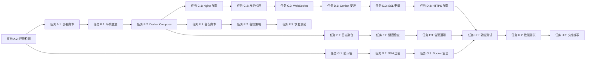

#### 模块 H：部署验证（4 任务点）

**文件**: `scripts/vps-verify.sh`

- [ ] **任务 H.1**：功能测试（2 点）
  - **输入**：部署完成的服务
  - **输出**：功能测试报告
  - **关键步骤**：
    1. 创建 `scripts/vps-verify.sh` 脚本
    2. 测试前端访问（curl https://yourdomain.com）
    3. 测试后端 API（curl https://yourdomain.com/api/health）
    4. 测试 WebSocket 连接
    5. 测试学生注册流程（端到端）
    6. 测试管理员登录功能
    7. 生成测试报告（JSON 格式）

- [ ] **任务 H.2**：性能测试（1 点）
  - **输入**：部署完成的服务
  - **输出**：性能测试报告
  - **关键步骤**：
    1. 使用 Apache Bench 或 wrk 进行压力测试
    2. 测试前端页面加载时间
    3. 测试 API 响应时间
    4. 测试并发连接数
    5. 记录性能指标（QPS、延迟、错误率）

- [ ] **任务 H.3**：编写部署文档（1 点）
  - **输入**：部署过程记录
  - **输出**：部署文档
  - **关键步骤**：
    1. 创建 `docs/VPS_DEPLOYMENT_GUIDE.md`
    2. 记录部署前准备工作
    3. 记录部署步骤与命令
    4. 记录常见问题与解决方案
    5. 记录运维操作手册（启动、停止、重启、查看日志）
    6. 记录回滚流程

---

## 3. 依赖关系

### 3.1 依赖图

### 3.2 依赖说明

| 任务 | 依赖于 | 原因 |
|------|--------|------|
| A.1 部署脚本 | A.2 环境检测 | 需要先确认服务器环境满足要求 |
| B.2 Docker Compose | B.1 环境变量 | 需要先配置环境变量 |
| C.2 反向代理 | C.1 Nginx 配置 | 需要先有主配置文件 |
| D.2 SSL 申请 | D.1 Certbot 安装 | 需要先安装 Certbot |
| D.3 HTTPS 配置 | D.2 SSL 申请 | 需要先获取证书 |
| E.2 备份策略 | E.1 备份脚本 | 需要先有备份脚本 |
| F.2 健康检查 | F.1 日志聚合 | 需要先配置日志系统 |
| F.3 告警通知 | F.2 健康检查 | 需要先有监控数据 |
| G.2 SSH 加固 | G.1 防火墙 | 需要先配置防火墙避免锁定 |
| H.1 功能测试 | D.3 HTTPS 配置 | 需要完整部署后才能测试 |
| H.2 性能测试 | H.1 功能测试 | 需要先确认功能正常 |
| H.3 文档编写 | H.2 性能测试 | 需要完整测试数据 |

### 3.3 并行任务

以下任务可以并行开发：

**阶段 1：准备阶段**
- 任务 A.1 部署脚本 ∥ 任务 B.1 环境变量 ∥ 任务 C.1 Nginx 配置

**阶段 2：配置阶段**
- 任务 E.1 备份脚本 ∥ 任务 F.1 日志聚合 ∥ 任务 G.1 防火墙

**阶段 3：优化阶段**
- 任务 B.3 Elasticsearch ∥ 任务 C.3 WebSocket ∥ 任务 E.3 恢复测试

---
